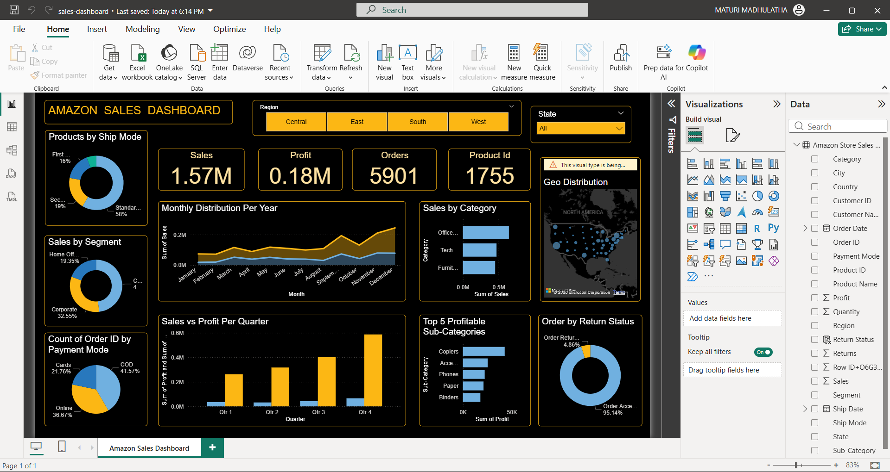

# Amazon Sales Dashboard (Power BI)

## Project Overview

This project presents an **Amazon Sales Dashboard** built using Power BI.
The dashboard provides insights into sales performance, profit, orders, and product distribution across different regions and categories.

The goal of this dashboard is to help analyze business performance and identify key trends in sales data.

---

## Dashboard Preview

---

## Tools Used

* Power BI Desktop
* CSV Dataset
* Data Visualization Techniques

---

## Dataset

The dataset used for this project contains information about:

* Orders
* Customers
* Sales
* Profit
* Product categories
* Shipping details
* Regional sales data

File location in this repository:
dataset/sales_data.csv

---

## Key Metrics in the Dashboard

The dashboard highlights the following important business metrics:

* **Total Sales:** 1.57M
* **Total Profit:** 0.18M
* **Total Orders:** 5901
* **Product IDs:** 1755

---

## Dashboard Insights

The dashboard provides insights such as:

* Sales distribution across different **regions (Central, East, South, West)**
* **Sales by category** such as Office Supplies, Technology, and Furniture
* **Monthly sales trends**
* **Top 5 profitable sub-categories**
* **Sales vs Profit by quarter**
* **Sales distribution by customer segment**
* **Order return status**
* **Geographical distribution of sales**

---

## Project Files

* `sales-dashboard.pbix` → Power BI dashboard file
* `dataset/sales_data.csv` → Dataset used in the dashboard
* `dashboard.png` → Screenshot of the dashboard

---

## How to Use

1. Download the `.pbix` file from this repository.
2. Open it using **Power BI Desktop**.
3. Explore the dashboard and interact with filters and visuals.

---

## Author
Madhu
